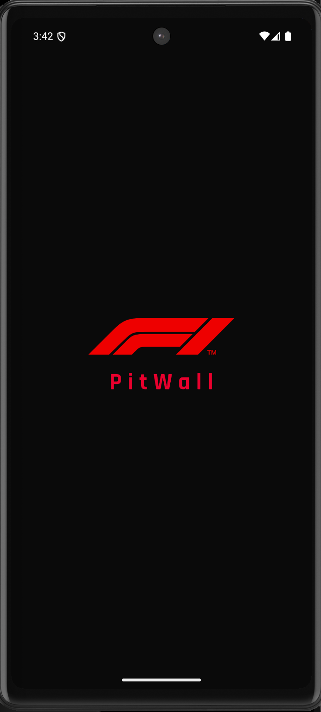
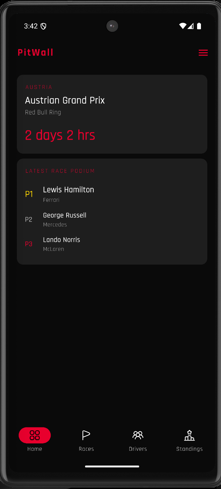

# PitWall 🏎️

A Flutter-based Formula 1 analysis app built for fans who want race data, standings, and insights beyond the headlines.

## Features

### Current

* Splash screen with animations
* Home dashboard
* Next race countdown
* Latest race podium
* Loading and error states
* Persistent bottom navigation

### Coming Soon

* Driver standings
* Constructor standings
* Race analysis
* Strategy analysis
* Driver comparison
* Driver profiles

## Tech Stack

* Flutter
* Riverpod
* Dio
* go_router
* OpenF1 API
* Jolpica API

## Screenshots

<p align="center">
  
  
</p>

## Roadmap

* [ ] Championship standings
* [ ] Race Hub
* [ ] Race Analysis
* [ ] Strategy Analysis
* [ ] Driver Comparison
* [ ] Driver Details
* [ ] Full Standings

## Getting Started

```bash
git clone https://github.com/snippetbyparth/pitwall.git
cd pitwall
flutter pub get
flutter run
```

## About

PitWall is a personal portfolio project built to improve my Flutter skills while creating something useful for Formula 1 fans.

---

Built by Parth Arora
